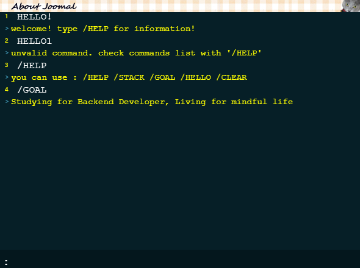
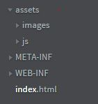

# AboutMeCMD

## 목차
1. <a href="#intro">소개</a>
2. <a href="#use">사용법</a>
3. <a href="#dev">개발일지</a>

---

<a name="intro"></a>
## 소개
</img>  
cmd 스타일로 자신을 소개할 수 있는 Phaser 기반 웹 어플리케이션입니다. (Phaser는 3.5.x 버전을 사용했습니다.)  
[해당 페이지](https://joomal.github.io/AboutMeCMD/index.html)에서 사용해보실 수 있습니다.  
아직 적용 중인 화면이지만, 실제 깃블로그에서는 [해당 페이지](https://joomal.github.io/about/)처럼 사용하고 있습니다.  

---

<a name="use"></a>
## 사용법
자신의 깃블로그에 삽입하기 위해서는 해당 레파지토리를 clone한 후, `codeSrcFull` 폴더 > `cmdGame` 폴더 > `assets`폴더와 `index.html`을 다운로드 받습니다.  
<br>
수정할 수 있는 사항은 다음과 같습니다.

### 이미지와 변수 변경

#### 로고 이미지 변경
cmd 상단의 로고를 변경할 수 있습니다.
1. 600x20 사이즈의 로고 이미지를 준비합니다.
2. `assets` > `images` 의 `logo.jpg`를 삭제 후 준비한 이미지를 추가합니다.
3. `main.js`의 `logo_img_context` 변수에서 이미지 경로를 수정합니다.

#### input box 변경
cmd 하단의 input Box를 변경할 수 있습니다. 기존 코드는 cmd창과 같은 색으로 지정되어있습니다.
1. 600x40 사이즈의 input box 이미지를 준비합니다.
2. `assets` > `images`의 `cmdGameInputBox.jpg`를 삭제 후 준비한 이미지를 추가합니다.
3. `main.js`의 `inputBox_context` 변수에서 이미지 경로를 수정합니다.

#### 사용자 지정 가능 변수 변경
1. `main.js`의 `start_message` : cmd를 시작하면 나오는 "HELLO!" 문구를 변경할 수 있습니다.
2. `main.js`의 `start_message_output` : 위의 문구에 대한 응답 메세지를 변경할 수 있습니다.
3. `main.js`의 `fail_load_logo_message` : 로고 이미지 로드에 실패할 경우 우측 상단에 삽입되는 메세지를 변경할 수 있습니다.
4. `main.js`의 `cmd_backgroundColor` : cmd 배경 색상을 변경할 수 있습니다.

#### 명령어 추가 및 변경
`main.js`의 command function에서 명령어와 이에 대한 응답 메세지를 추가하거나 수정할 수 있습니다.  

### 깃블로그 업로드
1. git page 레파지토리를 생성해 변경한 코드를 첨부합니다. 반드시 첨부되어야 하는 내용은 `assets` 폴더와 `index.html`입니다.  

</img>  

2. 해당 레파지토리의 index.html를 실행했을 때의 정상작동 여부를 파악한 후, 정상작동한다면 해당 주소를 복사합니다.  
3. 첨부를 원하는 깃블로그 페이지에 다음과 같은 html 코드를 삽입합니다. 레파지토리 주소는 보안 문제로 반드시 `https://`로 시작해야 하며, 
`index.html`로 끝납니다.  

```html
<iframe width="600" height="450" src="{레파지토리 주소}" frameborder="0" scrolling="no" align="center"> <p> 브라우저가 iframe 요소를 지원하지 않습니다. </p></iframe>
```

---

<a name="dev"></a>
### 개발일지

